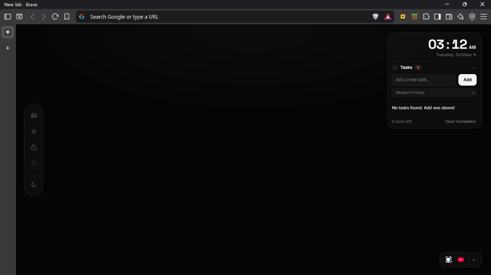
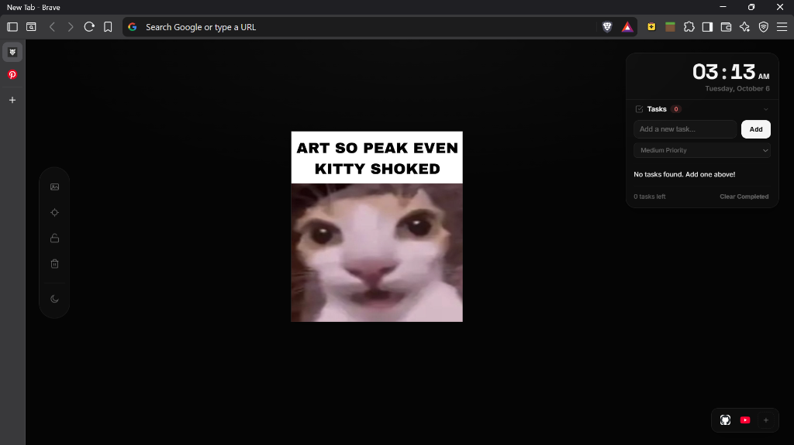
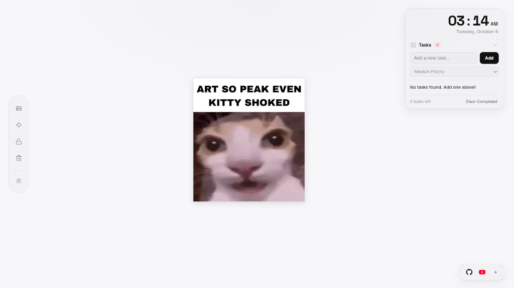
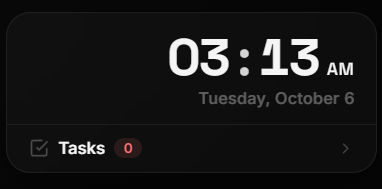
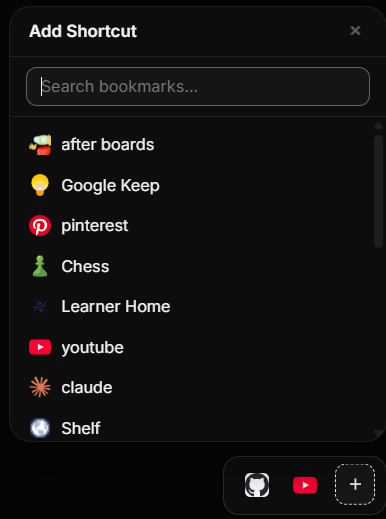

<div align="center">

# ⚡ Flash Dash

**Your personal focus dashboard, vision board, and daily command center right inside your new tab.**

[](https://developer.chrome.com/docs/extensions/mv3/)
[](https://developer.chrome.com/docs/extensions/mv3/intro/)
[](https://developer.mozilla.org/en-US/docs/Web/JavaScript)
[](https://github.com/aryankun27-a11y/flash-dash)

<br />



<br /><br />

*Every time you open a new tab, avoid digital clutter. Flash Dash transforms your new tab into an inspiring, calm, and distraction-free workspace tailored for focus, habit tracking, and goal achievement.*

</div>

---

## 🌟 Highlights

- 🖼️ **Infinite Vision Board**: Pin goal photos, memories, and inspiration with full drag-and-drop, 360° pan, zoom, and lock protection.
- ⏱️ **Focus Countdown & Pomodoro**: Double-click to enter Focus Mode with customizable duration presets, streak tracking, and built-in synthesizer chimes.
- 🕒 **Minimal Clock & Date Widget**: Clean, high-readability typography with instant 1-click toggling between 12-hour and 24-hour formats.
- 📋 **Integrated Daily Tasks**: Collapsible task card under the clock featuring priority tags (Low, Medium, High), animated checkmarks, and hold-to-reorder tasks.
- 🚀 **App Shortcuts Dock**: Bottom-right launcher for your favorite web apps. Search and pick from your Chrome bookmarks, or hold & drag icons to rearrange.
- 🌓 **Dynamic Dark & Light Modes**: Seamless aesthetic switching with buttery-smooth transitions and glassmorphism styling.
- 🔒 **Whiteboard Lock & Recenter**: Lock your canvas in place to avoid unwanted shifts, or snap back to center with a single click.
- 🛡️ **100% Private & Offline-First**: All data is stored directly on your machine via `chrome.storage.local` and IndexedDB—zero tracking, zero cloud telemetry.

---

## 📸 Screenshots & Previews

<div align="center">

### Vision Board in Action
*Drag and drop your goals, visual reminders, and memes anywhere on the infinite canvas.*



<br />

### Crisp Light Mode Theme
*Full dark and light mode support with glassmorphism and subtle ambient diffusion.*



<br />

| Minimal Clock & Tasks Capsule | Bookmark Shortcut Picker |
| :---: | :---: |
|  |  |
| *Click time to toggle 12h/24h • Collapsible task manager* | *Instant bookmark search • High-resolution favicons* |

</div>

---

## 🛠️ Key Features

### 1. Freeform Infinite Whiteboard / Vision Board
- **Pan & Zoom Canvas**: Navigate smoothly across an infinite virtual board with mouse wheel, trackpad, or spacebar drag.
- **Drag-and-Drop Pinning**: Drag images directly from your desktop or paste them from your clipboard.
- **Lock Board**: Freeze your whiteboard layout to prevent accidental moving or dragging while you work.
- **Recenter Control**: 1-click snap back to the origin coordinates of your canvas.
- **Clear All**: Safely wipe all photos with a custom confirmation dialog.

### 2. Minimal Clock & Daily Tasks Capsule
- **12h / 24h Toggle**: Click the clock numbers to instantly switch between 12-hour (with AM/PM badge) and 24-hour time.
- **Collapsible Tasks Card**: Smooth accordion card nested neatly below the clock with live pending count badges.
- **Priority Categorization**: Assign High, Medium, or Low priority badges to your tasks.
- **Inline Editing**: Double-click any task label to rename or refine it on the fly.
- **Drag-and-Drop Reordering**: Hold and drag tasks to organize your day into your ideal order of execution.
- **Batch Cleanup**: Clear all completed tasks with one click.

### 3. Bottom-Right App Shortcuts Dock
- **Quick App Launcher**: Floating matte-glass dock at the bottom-right for instant access to your daily tools.
- **Chrome Bookmarks Picker**: Click the `+` button to open a live-search popover that indexes and filters your browser bookmarks.
- **High-Res Favicons**: Automatically pulls sharp site icons with elegant monogram fallbacks.
- **Hold-to-Drag Reordering**: Press and hold any shortcut tile for 150ms to drag and rearrange your app sequence.
- **Hover Deletion**: Hover over any shortcut to reveal a subtle remove button (`×`).

### 4. Focus Mode & Countdown Timer
- **Quick Presets**: Jump straight into focus sessions with 10m, 25m, 30m, 45m, and 60m presets.
- **Custom Duration**: Type in any custom minute count directly into the countdown display.
- **Streak Tracker**: Keep your daily momentum with visual streak indicators.
- **Web Audio Synthesizer**: Pleasant completion chimes and alerts synthesized dynamically in-browser—no audio assets required.
- **Keyboard Shortcuts**: Quick control during deep work sessions.

### 5. Interactive Onboarding Tutorial
- **5-Step Spotlight Tour**: Automatically guides new users through the vision board, clock, tasks, shortcuts dock, and focus mode using smooth SVG cutout masking.
- **Replay Anytime**: Click "Take Tour" in the Creator Note or trigger `window.startTutorial()` in the console.

---

## ⌨️ Keyboard Shortcuts

| Shortcut | Context | Action |
| :--- | :--- | :--- |
| **Double Click** | Canvas / Clock | Enter / Exit Focus Mode |
| **Space** | Canvas | Hold to pan the whiteboard canvas |
| **Space** | Focus Mode | Play / Pause Timer |
| **R** | Focus Mode | Reset Timer to initial duration |
| **M** | Focus Mode | Toggle audio chime mute |
| **Esc** | Popovers / Tutorial | Close active picker popover / Skip tutorial |
| **Enter** | Tutorial / Modals | Advance to next step / Confirm modal dialog |

---

## 📦 Installation & Setup

Load Flash Dash as an unpacked extension into any Chromium-based browser (Google Chrome, Brave, Microsoft Edge, Arc, Opera, etc.):

1. **Clone or Download the Repository**:
   ```bash
   git clone https://github.com/aryankun27-a11y/flash-dash.git
   ```

2. **Open Extensions Page**:
   - In **Google Chrome**: Navigate to `chrome://extensions`
   - In **Brave**: Navigate to `brave://extensions`
   - In **Microsoft Edge**: Navigate to `edge://extensions`

3. **Enable Developer Mode**:
   - Toggle the switch labeled **"Developer mode"** in the top-right corner.

4. **Load the Extension**:
   - Click the **"Load unpacked"** button in the top-left corner.
   - Select the `flash dash` project folder containing `manifest.json`.

5. **Open a New Tab**:
   - Press `Ctrl + T` (or `Cmd + T` on macOS) to enjoy your new workspace!

---

## 🏗️ Project Structure

```
flash-dash/
├── manifest.json       # Manifest V3 extension configuration
├── newtab.html         # Semantic dashboard markup & overlays
├── style.css           # Design system tokens, matte glassmorphism, responsive scale
├── script.js           # Core canvas engine, clock, tasks, shortcuts, timer, storage
├── tutorial.js         # Interactive onboarding tour with SVG spotlight masking
├── assets/             # Screenshots and visual media for documentation
│   ├── dashboard-dark.png
│   ├── dashboard-light.png
│   ├── vision-board.png
│   ├── clock-tasks.png
│   └── shortcuts-picker.png
└── icons/              # Extension icons in 16x16, 48x48, and 128x128 sizes
```

### Storage Architecture
- **Queue-based Synchronization**: Prevents race conditions during simultaneous read/write operations with an asynchronous `StorageQueue`.
- **Hybrid Storage Strategy**:
  - `chrome.storage.local`: Lightweight settings, tasks, layout coordinates, and app shortcuts.
  - `IndexedDB (FlashDashDB)`: Large media blobs and vision board photo assets for reliable offline performance without storage limits.

---

## 🛡️ Privacy First

Flash Dash is built with a strict local-only privacy philosophy:
- **No Analytics or Trackers**: Zero third-party analytics, user tracking, or fingerprinting.
- **Local Persistence**: All photos, tasks, preferences, and streaks remain strictly inside your browser.
- **Minimal Permissions**: Requests only permissions essential for core utility (`storage`, `unlimitedStorage`, `bookmarks`, `topSites`).

---

## 👤 Author

Crafted with care by **[Aryan](https://github.com/aryankun27-a11y)**.

---

## 📄 License

Distributed under the MIT License. See `LICENSE` for more information.
